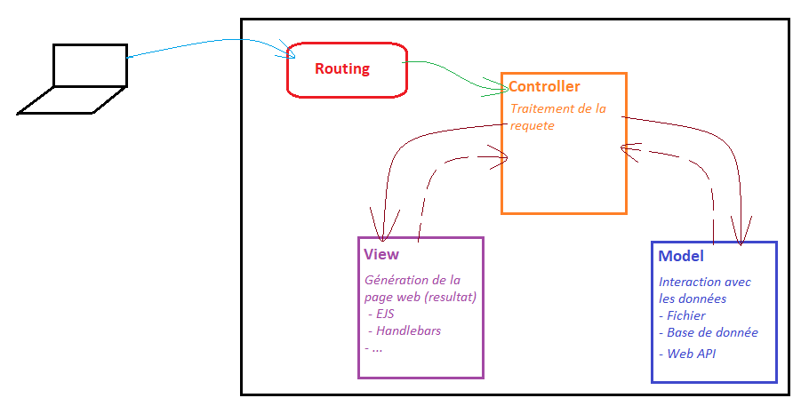

# Pattern MVC avec Express



## Structure de fichiers
```
controllers
 - home.controller.js
 - product.controller.js
models (Pour définir les modeles de DB)
 - product.js
services
 - product.service.js
routers
 - home.router.js
 - product.router.js
public (Pour les fichiers statique)
 - favicon.ico
views
  _shared
    - header.ejs
    - footer.ejs
  home
    - index.ejs
    - about.ejs
  product
    - index.ejs
    - detail.ejs
    - form-add.ejs
app.js
package.json
```

## Exemple de cheminement d'une requete dans la structure
### /about
- **app.js** \
Déclanchement des middlewares \
Redirection vers le router adapté

- **home.router.js** \
Interpretation de la requete (method, params, query, ...) \
Redirection vers le controller adapté

- **home.controller.js** \
Traitement de la requete \
Génération de la vue avec la méthode "render" (Views : home/about.ejs)

### /product/42
- **app.js** \
Déclanchement des middlewares \
Redirection vers le router adapté

- **product.router.js** \
Interpretation de la requete (method, params, query, ...) \
Redirection vers le controller adapté

- **product.controller.js** \
Traitement de la requete \
Utilisation des services pour obtenir les données \
En fonction du resultat du service : \
  → Génération de la vue avec la méthode "render" (Views : product/detail.ejs) \
  → Création d'un page d'erreur 404

- **product.service.js** \
Connexion à la base de donnée \
Recuperation des données de produit \
Renvoi des données au controller

## Initialisation du projet

### Packages
```
npm i express@5 ejs morgan
npm i nodemon --save-dev
```

### Setup
Générer le package.json via la command « npm init » \
Créer les fichiers suivants : \
 → Le ficher d'environnement « .env » \
 → « nodemon.json » pour configuré nodemon [Exemple](https://github.com/remy/nodemon/blob/master/doc/sample-nodemon.md) \
 → « app.js »


Modification du fichier package.json : \
 → Ajouter les scripts (dev / start) \
 → Définir le projet en mode "module"


Créer le fichier .gitignore \
Initiliser le repo git